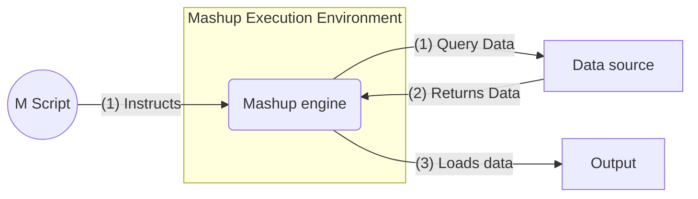

# Beaten by the best and come back for more.

It was extremely tough, and everyone else was faster, stronger, better; he felt and bit dust countless times, and did not achieve a single objective, the team leader thought he might be misplaced, that he didn´t belong there; he will come back for more.

Welcome to the first soccer training day of Alex, my six-year-old boy. After he told me how hard it was for him, I asked if he wanted to go back, his answer couldn´t be more impressive: Yes dad, I loved to participate!!!

My children have always thought me invaluable lessons, and this was one more: resilience and perseverance. Children, since they are born, fail a thousand times a day, they don´t give a damn about what others say, they don´t feel pity for themselves, they stand up, learn from the errors and keep trying.

Once more, I will humble myself and do my best to learn this valuable lesson from my six-year-old teacher: compete with the best, fail, stand up, learn and come back for more.