## What is Data Exfiltration in Power Query?
Data exfiltration is the act of moving sensitive data outside a trusted environment without authorization. In the context of Power Query (the data transformation engine behind Excel, Power BI, dataflows, etc.), this means an insider could use a Power Query script to siphon data from secure sources (like databases) out to an external destination. Microsoft defines data exfiltration as occurring when sensitive business data is accidentally or intentionally moved outside of a trusted boundary.[^1]

Power Query is powerful – it can connect to hundreds of data sources and, importantly, it can make web requests. By default, when Power Query runs in cloud services (e.g. Power BI dataflows or datamarts), it executes in the Power Query Online Mashup Engine, which operates in Microsoft's cloud with unrestricted internet access.[^2] In other words, if a user's Power Query code is executed in the cloud, it can potentially send data to any external endpoint on the internet. This creates a potential security blind spot for organizations: a savvy user with data access can craft a query that exfiltrates (sends out) sensitive data, bypassing typical network protections.

## Mashup Query Engine

The Mashup Engine is the core component of Power Query responsible for executing data extraction, transformation, and loading (ETL) processes. It interprets the M scripts—Power Query's formula language—and performs the operations defined within them.[^3]

### Mashup Execution Environment

The Mashup Engine operates within different environments depending on where Power Query is utilized:

* **Desktop Applications:** In tools like Excel and Power BI Desktop, the Mashup Engine runs locally on the user's machine, leveraging local resources for data processing.
* **Cloud Services:** In the Power BI service, the Mashup Engine executes in the cloud, utilizing Microsoft's infrastructure to process data.
* **On-Premises Data Gateway:** When accessing on-premises data sources from cloud services, the Mashup Engine operates through the data gateway, ensuring secure data transmission between on-premises sources and cloud services.


## How Can Power Query M Code Exfiltrate Data?
Power Query's M language allows combining data from multiple sources and calling web endpoints and Power Query can query a secure database and then silently send that data to an external web service. Let's illustrate with a simplified snippet of Power Query M code that demonstrates the core concept of data exfiltration:


```pq
let
    // Step 1
    SourceData = Read data from a secure SQL database,
    // Step 2
    Convert = Convert the data for transmission,
    // Step 3
    Result = Send the data out to an external API endpoint
in
    Result
```

> Figure: Simplified snippet of Power Query M code
    
In this example, the query connects to a Secure SQL Database (e.g. an internal FinanceDB) and retrieves data. Then it converts that data and uses a function to send the data to an external web service. The `Result` of the web call (if any) is returned by the query, but the key point is that the sensitive data has now left the organization – it's been sent to an external server controlled by the attacker.

Microsoft's own documentation explicitly notes this risk: "By using Web.Contents, users can make web requests with sensitive data in the body of the request".[^4] 


> Figure: Data Exfiltration Path via Power Query – The diagram above shows how an insider's Power Query can extract data from a secure database and send it to an outside API, all within a single Power Query execution.

In the above flow, the Power Query Mashup Engine (running in the cloud) has access to the secure SQL database (using provided credentials). It queries the data and then loads it into a semantic model **and out over the internet to an external endpoint.** Notice that this exfiltration can occur even if the data source is inside the corporate network – the Mashup Engine runs outside the network by default, so it isn't subject to the organization's internal firewalls or DLP scanners in the usual way.[^5] Effectively, the Power Query is acting as a bridge between the secure data source and the attacker's server.

## Why Is It Hard to Prevent This? (No Foolproof Safeguard)

It may be startling, but there is currently no foolproof way to completely prevent data exfiltration from a Power Query file under Microsoft's current model. If a user has access to create or edit Power Query queries (in Excel, Power BI, dataflows, etc.) and they have access to some sensitive data source, they can potentially craft M code to leak that data. The Power Query runtime will happily execute the code as long as the user is authorized to access the sources and run queries. 

By design, the default Power Query Online environment trusts the user's code and has no fine-grained content inspection or egress filtering of its own. Microsoft warns that the cloud-based Mashup Engine runs outside the tenant's network and is not subject to corporate firewalls or DLP policies, meaning data can flow to any destination the user has access to.[^6] In essence, once the query is running, the service will perform whatever data connections the code specifies – whether that's pulling from a database or pushing to an external URL. There is no built-in setting like "disable web access in queries" or "allow queries to only connect to approved endpoints" at the Power Query level today. This is why the problem is often described as an insider threat scenario; it assumes the person executing the query is authorized to access the data in the first place, and then abuses that privilege. 

To reiterate, no native Power Query setting can outright stop a determined user from embedding an exfiltration step in their M code. Organizations must instead rely on broader security strategies to mitigate this risk. Microsoft's guidance (as of early 2024) focuses on external controls – essentially making it harder for that malicious query to succeed by constraining where and how Power Query code runs. Below we'll examine the current best practices and protections Microsoft recommends, and then why those measures still have limitations.

## Microsoft's Recommended Protections and Best Practices

Microsoft has acknowledged the data exfiltration risk in official documentation and outlines several best practices to help protect against it.[^7][^8]

These protections mainly involve network-level controls and execution policies rather than application-level restrictions in Power Query itself. The key strategies include:

* **Network Isolation of Data Sources:** Lock down your sensitive data sources so that they can only be accessed from approved network locations. For example, use firewall rules, Azure Virtual Network service endpoints, Private Links, or network security groups to ensure that the database or data source cannot be reached directly from the public Internet.[^9] The idea is to obstruct line-of-sight from the cloud-based Power Query engine to your data. If the Power Query Mashup Engine (running in the cloud) tries to connect to a protected database that isn't reachable outside the corporate network, the connection will fail.[^10] In practice, this often means forcing the query to go through an on-premises data gateway or a VNet gateway that resides in your network. Microsoft notes that when a dataflow or query is bound to a gateway (due to the source being isolated), all data access in that query will occur via that gateway – cloud and gateway execution are never mixed in a single query.[^11] Because the gateway runs within your controlled environment, it will be subject to your organization's firewalls, network monitoring, and DLP solutions.[^12] Essentially, network isolation + gateway enforcement makes the Power Query run as if it were on a corporate machine, where you can apply your usual outbound restrictions (for instance, blocking it from calling unknown external websites).

```mermaid
flowchart LR
    A((M Script))
    B[Cloud Execution<br/>Environment]
    C[Sensitive<br/>Database]
    E[External API<br/>attacker-controlled]
    H[Semantic<br/>Model]

    subgraph "Corporate Network Boundary"
        A
        
        subgraph D[Gateway Execution Environment]
            G[Mashup Engine]
            F1[/🧱 Firewall\]
        end
        
        
        C
        H
    end

    %% Cloud engine bypassed
    A -- "(1) Instructs" --> G
    A -. "Not used" .-> B
    
    %% Gateway execution - now through both firewalls
    G -- "(2) Request" --> F1
    F1 -- "(3) Safelisted<br/>Request" --> C
    
    %% Return data flow
    C -- "(4) Returns Data" --> F1
    F1 -- "(5) Returns Data" --> G

    %% Outbound control

    G --(6) Tries to send data --> F1
    F1 -. "(7) ❌ Blocked by firewall rules" .-> E
    G -- "(8) ❌ Data Load Failure" --> H
    
    B:::disabled
    E:::outside
    classDef outside fill:#fdd
    classDef disabled fill:#eee,stroke-dasharray: 5 5
```



* **Force On-Premises (Gateway) Execution:** If truly necessary, an organization can disable cloud execution of Power Query entirely, **forcing all queries to run through on-premises gateways.** Currently, Microsoft offers this as a tenant-wide policy (set via a support ticket) that turns off the Power Query Online Mashup Engine for the entire tenant.[^13][^14] After this policy is applied, any attempt at cloud evaluation will fail with an error like *"Cloud evaluation request denied based on tenant policies. Please use a data gateway and try again."*[^15] This effectively guarantees that none of your Power Query code runs in Microsoft's cloud environment – everything has to go through a gateway that you control. However, this is a very blunt measure: it's all or nothing (more on the drawbacks later). Microsoft notes that this policy impacts all dataflow-like operations (Power BI dataflows, Fabric dataflows, Power Platform dataflows, datamarts, etc.), and it is applied tenant-wide, not to specific workspaces or users.[^16] In other words, you can't selectively allow some cloud executions and block others with this policy; turning it on will break any queries that were not already using a gateway, until they are reconfigured.

* **Tenant and Identity Policies:** Another aspect of Microsoft's guidance is to use identity-driven controls to prevent data from leaving the organization's tenant or being accessed by unauthorized users. For cloud SaaS data stores (like Dataverse, Fabric Lakehouse, or even Power BI itself as a data source), pure network isolation might not be feasible because these services have multi-tenant endpoints. Instead, Microsoft recommends tenant isolation policies at the Azure AD (Entra ID) level.[^17][^18] Examples include: only allow authentication via your organization's Azure AD (no using generic usernames/passwords or anonymous access to data sources), enforce location-based conditional access so that only users on managed devices (e.g. corporate laptops or network) can access the Power BI/Fabric service, and use tenant restrictions to block your users from signing into other tenants' Power BI environments (and vice versa).[^19] These measures help ensure that a user can't, say, use their credentials on an external Power BI tenant or tool to pull data out, and that only approved devices within your org can run queries. While these identity-centric controls don't directly stop something like `Web.Contents` calls, they do guard against certain exfiltration paths (such as an employee trying to shuttle data to another cloud tenant or personal account).

* **Governance and Monitoring:** In addition to preventive controls, Microsoft is adding auditing and governance features to address this gap. Administrators can leverage Power BI/Fabric audit logs (via Microsoft Purview) to monitor data connection activities.[^20][^21] Every time a Power Query data source connection is created or used, it can be logged with details like who ran it, what data source was accessed, and whether a gateway was involved.[^22][^23] This doesn't stop an exfiltration attempt in real-time, but it provides a trail that could identify suspicious behavior (for example, a user suddenly using a Web data source or an unknown API in their query). Microsoft's roadmap also includes features like data source allowlisting – which will let tenant admins restrict what connectors or endpoints can be used in Power Query – and enhanced auditing of query activities.[^24] These are not yet fully available as of this writing, but they indicate that finer-grained controls are on the way.

In summary, Microsoft's current best practices to mitigate Power Query exfiltration risks involve shifting execution into controlled environments (gateways or isolated networks), and layering on network/identity policies and monitoring. All of these assume the organization takes explicit action to constrain how Power Query runs. If you do nothing, the default is that the Power Query Online engine will run your code in the cloud with open internet access – a scenario in which an insider could potentially send data anywhere.[^25][^26]

## Limitations and Shortcomings of the Current Approach

While the above measures can reduce the risk, they come with significant limitations. It's important to understand these shortcomings:

* **Heavy Reliance on Network Layer Security:** The primary defense is essentially "don't let the cloud engine talk to anything it shouldn't" by using network isolation. This puts a lot of onus on infrastructure setup – every sensitive data source must be properly firewalled or put behind private networks. Any gap (for instance, a database that allows public IP access or an allowed outbound route to the internet) can be exploited by a malicious query. Microsoft explicitly notes that higher-layer controls like app-level policies or conditional access are not sufficient; you really need network-level or lower isolation for sensitive data.[^27] Not every organization is prepared to enforce strict network rules for all data sources, and doing so can be complex and costly (especially if you have many data systems). In short, the current model leans on traditional network security – if that's not airtight, Power Query can punch through it.

* **No Fine-Grained Power Query Controls:** Today, there is a lack of fine-grained controls within Power Query itself. If you allow people to author queries, you are inherently allowing them to use the full M language power. There's no built-in way to say "user X's queries cannot call Web.Contents" or "only allow queries to connect to domain Y" in the Power BI or Excel UI. The platform doesn't let an admin easily restrict specific functions or external calls on a per-file or per-workspace basis. The all-or-nothing tenant policy to disable cloud execution is basically the only switch, and it doesn't discriminate between "good" and "bad" queries. Microsoft has recognized this gap – hence the planned feature to allowlist or block specific connectors/endpoints.[^28] – but until that arrives, organizations have limited options. This means a determined insider with edit rights can use any connector or function at their disposal in M. Even if you only give someone access to one data source, they could still combine it with a Web connector in the query to send data out. There is also no content inspection of the M script by the service that could catch something like "hey, this query is posting data to an unknown URL" – it will just execute it.

* **Tenant-Level "Kill Switch" is All or Nothing:** The strongest preventive measure available – turning off the cloud Mashup Engine – applies to the entire tenant and all Power Query workloads.[^29] This is a very coarse control. In a large organization, completely forcing gateway execution can be disruptive: all dataflows, datamarts, and even certain Power BI features (like Quick Import from SharePoint or some transformations) will stop running in the cloud and require a gateway or will break.[^30] There's no way to enforce the restriction for only a subset of workspaces or only for certain users. It's also not a toggle you can self-serve in the admin portal as of now – it requires filing a support ticket to get it enabled.[^31] Because it's tenant-wide, if you enable it, you need to have gateways set up for every scenario, and sufficient capacity on those gateways to handle the load.[^32] This heavy-handed approach might be unacceptable for organizations that rely on cloud dataflows for convenience or have many existing cloud refreshes. In practice, many companies hesitate to use this nuclear option, leaving them to rely on the network and policy approaches above – which, as noted, are not foolproof.

* **Insider Threat Still Exists:** Even with all the controls, remember that these measures primarily make it harder (or more detectable) to exfiltrate data – they don't eliminate the possibility entirely. For example, if an organization allows Power Query to run in the cloud for convenience, and just trusts network isolation, a savvy insider might still find an endpoint that is allowed. Or if an on-premises gateway is used, but that gateway machine itself has unrestricted internet access, the query's `Web.Contents` call could run through the gateway and out to the internet (unless the gateway's environment is locked down by network rules). Identity policies (like tenant restrictions or managed device requirements) help prevent certain routes of exfiltration (such as using an external tenant or unmanaged PC), but they don't stop a query from sending data to an anonymous external API from within an allowed session. Ultimately, an authorized user abusing their data access via Power Query is difficult to stop without either removing their access or implementing very restrictive infrastructure controls.

* **Lack of Visibility and Granular Auditing:** Although auditing capabilities are improving, it can still be non-trivial to spot what exactly a query is doing. The audit logs will tell you that a data source was accessed or maybe that a Web data source was used, but they won't necessarily flag "this query sent 500 customer records to example.com." There's no content inspection of the payload in logs. So detection of malicious use might require correlating logs (e.g. noticing that right after someone accessed a sensitive SQL data source, they also made a series of web calls). This is more of a SOC (Security Operations) challenge – and many orgs might not have the resources to deeply analyze Power BI/PQ usage logs. In short, current protections are largely preventive at the network/identity level, and any detective controls are still rudimentary.

## Conclusion: Raising Awareness and Next Steps

The ability to perform complex data mashups is one of Power Query's greatest strengths – but as we've seen, it also introduces a serious security concern. An insider with the know-how can leverage Power Query to bypass traditional data loss prevention, making it a potential data exfiltration pipeline if left unchecked. The current Microsoft model does not offer an out-of-the-box, foolproof block against this behavior. Instead, organizations must use a combination of network isolation, gateway enforcement, and strict tenant-level policies to mitigate the risk, and even then, gaps remain. For IT administrators and data platform owners, the key takeaway is to be aware of this blind spot. If your environment allows Power Query to run code in the cloud (as is the case with Power BI dataflows, datamarts, Excel Online, etc.), you should assume that any data accessible by those queries could potentially be sent to an external site. In high-security environments, strongly consider disabling cloud-based Power Query execution (even though it's an extreme step) or tightly constrain it to what's absolutely necessary. At the very least, implement the network isolation strategies – ensure that sensitive databases can only be reached via your controlled networks or gateways, not directly from the internet.[^33][^34]

Moving forward, we can anticipate better controls from Microsoft (such as connector allowlisting and improved auditing),[^35] but until then, we have to rely on these broader security measures. Educate your teams about this risk so that power users and analysts understand why certain restrictions (like using gateways or blocking unknown connectors) might be in place. If you're a Power BI or IT admin, keep an eye on tenant settings and the roadmap for any new data exfiltration protection features. This is a nuanced security hole – it's not a traditional "bug" that can be patched, but rather an inherent capability being misused. Closing it completely is non-trivial, which is why awareness is crucial. By knowing the limits of current protections, you can better harden your environment and avoid unpleasant surprises. The bottom line is that data exfiltration via Power Query is possible and challenging to prevent, especially in cloud-enabled scenarios[^36] – so it's on us to be vigilant and put layers of defense around it.


## More resources: 
* [Power BI dataflows enhanced compute engine](https://ssbipolar.com/2019/06/29/power-bi-dataflows-enhanced-compute-engine)
* [Query evaluation in Power Query](https://learn.microsoft.com/en-us/power-query/query-folding-basics)
* [On-premises data gateway January update is now available](https://powerbi.microsoft.com/en-us/blog/on-premises-data-gateway-january-update-is-now-available/)

[^1]: https://learn.microsoft.com/en-us/data-integration/gateway/data-connection-auditing#:~:text=Data%20exfiltration%20occurs%20when%20sensitive,or%20Power%20BI%20semantic%20models
[^2]: https://learn.microsoft.com/en-us/data-integration/gateway/data-connection-auditing#:~:text=data%20across%20hundreds%20of%20supported,accidental%20or%20malicious%20data%20exfiltration
[^3]: https://learn.microsoft.com/en-us/power-query/query-folding-basics
[^4]: https://learn.microsoft.com/en-us/power-query/dataflows/data-exfiltration-best-practices#:~:text=,against%20another%20untrusted%20data%20source
[^5]: https://learn.microsoft.com/en-us/power-query/dataflows/data-exfiltration-best-practices#:~:text=A%20trusted%20user%20who%20has,programs%20can%20exfiltrate%20sensitive%20data
[^6]: https://learn.microsoft.com/en-us/power-query/dataflows/data-exfiltration-best-practices#:~:text=A%20trusted%20user%20who%20has,programs%20can%20exfiltrate%20sensitive%20data
[^7]: https://learn.microsoft.com/en-us/power-query/dataflows/data-exfiltration-best-practices#:~:text=,and%20best%20practices%20for%20safeguards
[^8]: https://learn.microsoft.com/en-us/power-query/dataflows/data-exfiltration-best-practices#:~:text=unrestricted%20internet%20access,to%20flow%20between%20these%20sources
[^9]: https://learn.microsoft.com/en-us/power-query/dataflows/data-exfiltration-best-practices#:~:text=We%20recommend%20that%20all%20data,considered%20insufficient%20for%20this%20purpose
[^10]: https://learn.microsoft.com/en-us/power-query/dataflows/data-exfiltration-best-practices#:~:text=These%20network%20isolation%20policies%20must,Additionally%2C%20since
[^11]: https://learn.microsoft.com/en-us/power-query/dataflows/data-exfiltration-best-practices#:~:text=the%20public%20internet%29,as%20firewalls%20and%20DLP%20protection
[^12]: https://learn.microsoft.com/en-us/power-query/dataflows/data-exfiltration-best-practices#:~:text=access%20is%20then%20required%20to,execution%20in%20a%20cloud%20environment
[^13]: https://learn.microsoft.com/en-us/power-query/dataflows/data-exfiltration-best-practices#:~:text=The%20goal%20for%20isolating%20sensitive,Impacted%20capabilities%20include
[^14]: https://learn.microsoft.com/en-us/power-query/dataflows/data-exfiltration-best-practices#:~:text=After%20application%20of%20the%20policy%2C,to%20accommodate%20all%20their%20workloads
[^15]: https://learn.microsoft.com/en-us/power-query/dataflows/data-exfiltration-best-practices#:~:text=After%20application%20of%20the%20policy%2C,to%20accommodate%20all%20their%20workloads
[^16]: https://learn.microsoft.com/en-us/power-query/dataflows/data-exfiltration-best-practices#:~:text=a%20full%20network%20isolation%20solution,to%20accommodate%20all%20their%20workloads
[^17]: https://learn.microsoft.com/en-us/power-query/dataflows/data-exfiltration-best-practices#:~:text=For%20most%20software,provided%20by%20Microsoft%20Entra%20ID
[^18]: https://learn.microsoft.com/en-us/power-query/dataflows/data-exfiltration-best-practices#:~:text=,14
[^19]: https://learn.microsoft.com/en-us/power-query/dataflows/data-exfiltration-best-practices#:~:text=,14
[^20]: https://learn.microsoft.com/en-us/data-integration/gateway/data-connection-auditing#:~:text=How%20to%20use%20data%20connection,auditing
[^21]: https://learn.microsoft.com/en-us/data-integration/gateway/data-connection-auditing#:~:text=Shortcuts,find%20all%20connections%20by%20querying
[^22]: https://learn.microsoft.com/en-us/data-integration/gateway/data-connection-auditing#:~:text=Auditing%20for%20data%20source%20connections,find%20all%20connections%20by%20querying
[^23]: https://learn.microsoft.com/en-us/data-integration/gateway/data-connection-auditing#:~:text=For%20each%20attempted%20connection%2C%20we,include%20the%20following%20information
[^24]: https://learn.microsoft.com/en-us/power-query/dataflows/data-exfiltration-best-practices#:~:text=The%20following%20list%20contains%20some,data%20exfiltration%20risks%20in%20Fabric
[^25]: https://learn.microsoft.com/en-us/power-query/dataflows/data-exfiltration-best-practices#:~:text=unrestricted%20internet%20access,to%20flow%20between%20these%20sources
[^26]: https://learn.microsoft.com/en-us/power-query/dataflows/data-exfiltration-best-practices#:~:text=A%20trusted%20user%20who%20has,programs%20can%20exfiltrate%20sensitive%20data
[^27]: https://learn.microsoft.com/en-us/power-query/dataflows/data-exfiltration-best-practices#:~:text=We%20recommend%20that%20all%20data,considered%20insufficient%20for%20this%20purpose
[^28]: https://learn.microsoft.com/en-us/power-query/dataflows/data-exfiltration-best-practices#:~:text=,creation%2C%20updating%2C%20deletion%2C%20and%20usage
[^29]: https://learn.microsoft.com/en-us/power-query/dataflows/data-exfiltration-best-practices#:~:text=a%20full%20network%20isolation%20solution,to%20accommodate%20all%20their%20workloads
[^30]: https://learn.microsoft.com/en-us/power-query/dataflows/data-exfiltration-best-practices#:~:text=After%20application%20of%20the%20policy%2C,to%20accommodate%20all%20their%20workloads
[^31]: https://learn.microsoft.com/en-us/power-query/dataflows/data-exfiltration-best-practices#:~:text=The%20goal%20for%20isolating%20sensitive,Impacted%20capabilities%20include
[^32]: https://learn.microsoft.com/en-us/power-query/dataflows/data-exfiltration-best-practices#:~:text=a%20full%20network%20isolation%20solution,to%20accommodate%20all%20their%20workloads
[^33]: https://learn.microsoft.com/en-us/power-query/dataflows/data-exfiltration-best-practices#:~:text=These%20network%20isolation%20policies%20must,Additionally%2C%20since
[^34]: https://learn.microsoft.com/en-us/power-query/dataflows/data-exfiltration-best-practices#:~:text=connections%20to%20an%20on,risks%20associated%20with%20arbitrary%20code
[^35]: https://learn.microsoft.com/en-us/power-query/dataflows/data-exfiltration-best-practices#:~:text=The%20following%20list%20contains%20some,data%20exfiltration%20risks%20in%20Fabric
[^36]: https://learn.microsoft.com/en-us/power-query/dataflows/data-exfiltration-best-practices#:~:text=A%20trusted%20user%20who%20has,programs%20can%20exfiltrate%20sensitive%20data

