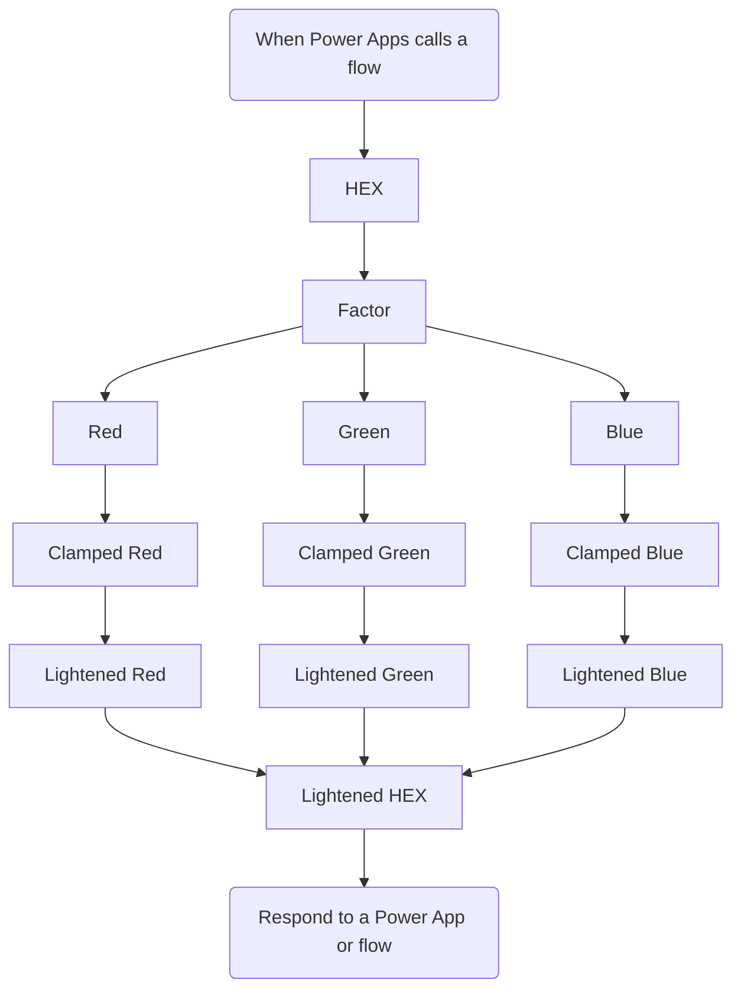

# Lighten a HEX Color in Power Automate / Logic Apps

Have you ever needed to adjust a color in your flow—for example, to make it lighter so you can highlight a section of your UI? Below, I’ll show you a simple approach to:

1. Receive a HEX color string, such as `#336699`.
2. Convert it to its Red, Green, and Blue components.
3. Lighten each component by a specific factor.
4. Convert them back into a new HEX string.

---

## Steps to Calculate a Lighter Shade

1. **Convert the HEX color to RGB**  
   Split the HEX string into its red, green, and blue components, and convert each pair to a decimal value (0–255).

2. **Blend with white**  
   For each RGB component, calculate the new value by moving closer to white (`255` for each component). This can be done using the following ratio:

   ```
   New Component = Original Component + (255 - Original Component) × Lighten Factor
   ```

   - **Original Component**: Decimal value of the R, G, or B component  
   - **Lighten Factor**: A value between 0 and 1 (e.g., 0.2 for a 20% lighter shade)

3. **Reconvert to HEX**  
   Convert the modified RGB values back to a two-character HEX format and assemble them into `#RRGGBB`.

### Example

Let’s say you want to lighten `#336699` by **20%** (i.e., a factor of **0.2**):

1. **Convert HEX to RGB**:
   - `#33` = 51 (decimal R)
   - `#66` = 102 (decimal G)
   - `#99` = 153 (decimal B)

2. **Apply the formula**:

   - **Red**:
     ```
     51 + (255 - 51) × 0.2
     = 51 + 40.8
     = 91.8
     ≈ 92
     ```
   - **Green**:
     ```
     102 + (255 - 102) × 0.2
     = 102 + 30.6
     = 132.6
     ≈ 133
     ```
   - **Blue**:
     ```
     153 + (255 - 153) × 0.2
     = 153 + 20.4
     = 173.4
     ≈ 173
     ```

3. **Convert back to HEX**:
   - **Red (92)** → `5C`
   - **Green (133)** → `85`
   - **Blue (173)** → `AD`

**Final lighter HEX color**: `#5C85AD`

---

## Flow Steps in Power Automate / Logic Apps

1. **Trigger**  
   Receive a HEX color (e.g., `#336699`) from Power Apps or another caller.

2. **Initialize Variables**  
   - `HEX`: Stores the incoming color string.  
   - `Factor`: A `float` value that determines how much to lighten (e.g., `0.8`).

3. **Compute Decimal RGB**  
   - Separate the `HEX` string into pairs (R, G, B).
   - Convert each pair to a decimal value.

4. **Clamp and Lighten**  
   - For each channel, apply a formula like:
     ```
     Clamped_Red = min(
       255,
       max(0, Red + (255 - Red) * Factor)
     )
     ```
   - Ensures the value never goes below `0` or above `255`.

5. **Convert Back to HEX**  
   - Convert each clamped float back into a two-digit hex string.
   - Remove decimals via substring logic and parse them as integers.

6. **Combine Final HEX**  
   - Concatenate the three two-digit hex components into a single string: `#RRGGBB`.

7. **Respond**  
   - Return the new, lightened HEX color to the caller.

---

## Flow Diagram



---

## Conclusion

This approach allows you to **lighten a HEX color** in Power Automate or Logic Apps by splitting out the RGB components, blending each with white using a chosen factor, and reconstructing the final color as `#RRGGBB`. It’s a straightforward way to programmatically adjust colors for various UI or integration scenarios.

**Happy Automating!**
